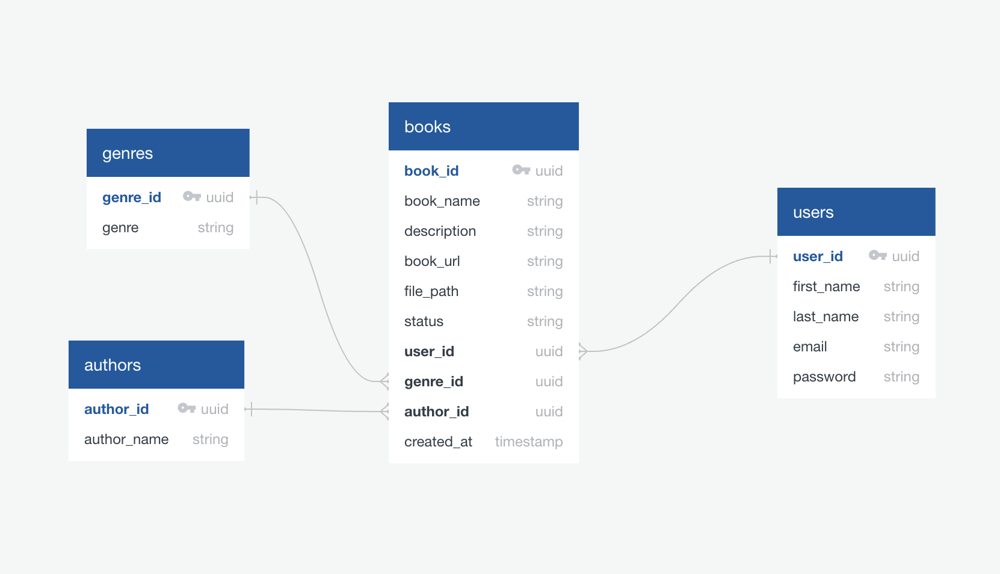

# Bookshelf API

- <a href="http://ec2-16-171-171-88.eu-north-1.compute.amazonaws.com/api-doc" target="_blank">API documentation</a>

<br>

# Description

Introducing Bookshelf API: Explore, Collect, Share. Your go-to for storing and sharing your favorite books. Create your account and start storing your book <strong>PRIVATE</strong> as for yourself or <strong>PUBLIC</strong> to be added to our big collection of books so can others explore. <br/> <br/>
The server was built with `Express` and `PostgreSQL`, employing `JWT` for authentication, storing tokens securely in `HTTP-only` cookies. To improve security, consider setting security headers, implementing token expiration, adding token revocation, managing secrets securely, validating user input, implementing rate limiting, and setting up logging and monitoring.

<br>

# Tools

- JavaScript
- Express (Node.js framework)
- JSON Web Token (JWT create token)
- Bcrypt (password hashing)
- PostgreSQL (SQL database)
- Firebase (file storage)
- AWS EC2 Instance (Hosting server & Website)
  <br>
  <br>

# ERD


<br/>
<br/>

# start project

- run `npm run start`
- make sure to add some envirment variables

```bash
SERVER_URL=https://bookshelf-app-dv7j.onrender.com #server ul if you run the project localy then add this instead http://localhost:3000

# database

POSTGRES_HOST=  #database host name

POSTGRES_PORT= #databse port most of database is 5432

POSTGRES_USER=   #database name

POSTGRES_PASSWORD= #databse password

POSTGRES_DB=  #database name

SECRET_KEY= #secret key for token

# firebase
FIREBASE_PRIVATE_KEY_ID= #private key id of firebase can find it when you crearte a storage

FIREBASE_CLIENT_EMAIL= # firebase email that provided with private key id

FIREBASE_CLIENT_ID= # client id provided with private key id
```

<br/>

# Developer

**Gorgees Odisho**

- [LinkedIn](https://www.linkedin.com/in/gorgees/)

<br>
